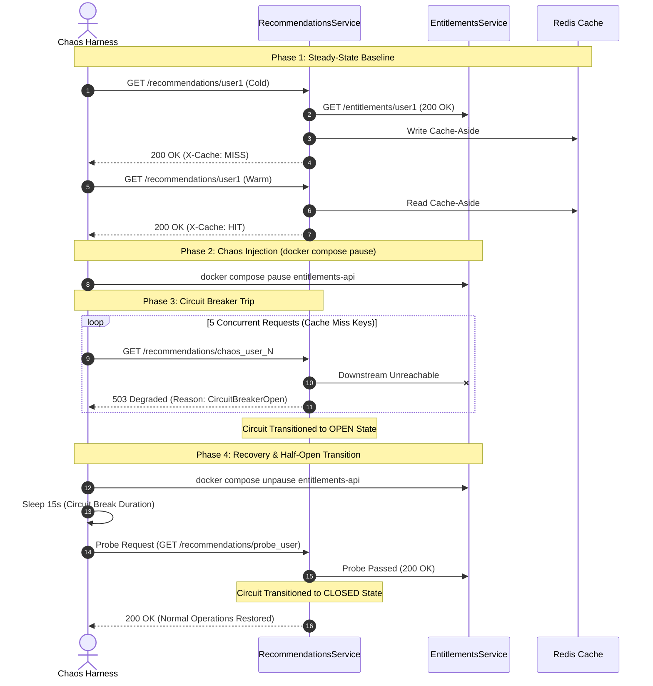

# Step 2: Containerization, Docker Compose Topology & Chaos Testing Harness

## Architectural Objective
Containerize `RecommendationsService` and `EntitlementsService` using multi-stage Linux Alpine Docker images, configure a resilient multi-container Docker Compose topology with native health checks, and build automated chaos testing scripts (`chaos-test.ps1` & `chaos-test.sh`) to validate and observe the full Polly v8 circuit breaker state machine in real-time.

---

## 1. Project Directory & File Manifest

```text
CloudNativeResiliencePatterns/
├── .dockerignore
├── docker-compose.yml
├── scripts/
│   ├── chaos-test.ps1
│   └── chaos-test.sh
├── src/
│   ├── EntitlementsService/
│   │   └── Dockerfile
│   └── RecommendationsService/
│       └── Dockerfile
```

---

## 2. Multi-Stage Dockerfile Specifications

### Base Images
- **Build Stage**: `mcr.microsoft.com/dotnet/sdk:8.0-alpine`
- **Runtime Stage**: `mcr.microsoft.com/dotnet/aspnet:8.0-alpine`
- **Rationale**: Alpine provides minimal footprint (~100MB) while maintaining a POSIX shell and `wget` for native Docker container healthchecks.

### Healthcheck Directives
```dockerfile
HEALTHCHECK --interval=5s --timeout=3s --start-period=5s --retries=3 \
  CMD wget --no-verbose --tries=1 --spider http://localhost:8080/health || exit 1
```

---

## 3. Docker Compose Topology (`docker-compose.yml`)

```yaml
version: '3.8'

services:
  redis-cache:
    image: redis:7.2-alpine
    container_name: redis-cache
    ports:
      - "6379:6379"
    healthcheck:
      test: ["CMD", "redis-cli", "ping"]
      interval: 5s
      timeout: 3s
      retries: 5
    networks:
      - resilience-net

  entitlements-api:
    build:
      context: .
      dockerfile: src/EntitlementsService/Dockerfile
    container_name: entitlements-api
    ports:
      - "5001:8080"
    environment:
      - ASPNETCORE_ENVIRONMENT=Development
      - ASPNETCORE_URLS=http://+:8080
    healthcheck:
      test: ["CMD-SHELL", "wget --no-verbose --tries=1 --spider http://localhost:8080/health || exit 1"]
      interval: 5s
      timeout: 3s
      retries: 3
      start_period: 5s
    networks:
      - resilience-net

  recommendations-api:
    build:
      context: .
      dockerfile: src/RecommendationsService/Dockerfile
    container_name: recommendations-api
    ports:
      - "5000:8080"
    environment:
      - ASPNETCORE_ENVIRONMENT=Development
      - ASPNETCORE_URLS=http://+:8080
      - ConnectionStrings__Redis=redis-cache:6379
      - Services__EntitlementsUrl=http://entitlements-api:8080
    depends_on:
      redis-cache:
        condition: service_healthy
      entitlements-api:
        condition: service_healthy
    healthcheck:
      test: ["CMD-SHELL", "wget --no-verbose --tries=1 --spider http://localhost:8080/health || exit 1"]
      interval: 5s
      timeout: 3s
      retries: 3
      start_period: 5s
    networks:
      - resilience-net

networks:
  resilience-net:
    driver: bridge
```

---

## 4. Automated Chaos Testing Harness (`chaos-test.ps1` / `chaos-test.sh`)

The chaos script validates the 4 operational phases of the resilience pipeline:



---

## 5. Verification Plan

### Automated Verification Steps:
1. **Container Build & Health Verification**:
   - `docker compose up --build -d`
   - `docker compose ps` asserts all 3 services (`recommendations-api`, `entitlements-api`, `redis-cache`) are `healthy`.
2. **Execute Chaos Harness**:
   - Run `pwsh scripts/chaos-test.ps1` or `bash scripts/chaos-test.sh`.
   - Assert visual logging of state transitions:
     - `CLOSED` (Baseline 200 OK)
     - `CHAOS INJECTED` (Entitlements paused)
     - `OPEN` (503 Fast Fallback with retry-after)
     - `HALF-OPEN -> CLOSED` (Probing succeeds, 200 OK restored).
